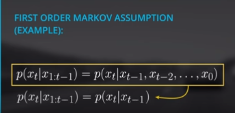
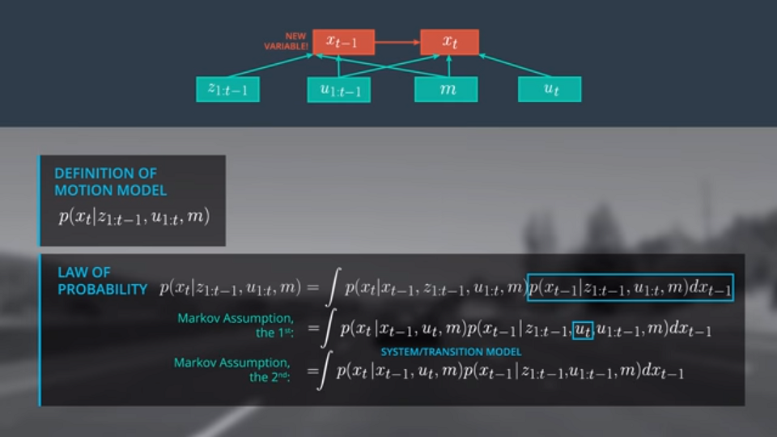

# Explain Markov Assumption For Motion Model

### First Order Markov Assumption

Assume you want to estimate the posterior distribution of **p(x_t)** given all previous states, and you have no observations or controls. You can write this distribution as the following:

This relation can be represented as a chain. For example, to estimate or predict **x_1**, we only use **x_0**. To estimate **x_2** we use **x_1** and **x_0**. Finally, for **x_3** we use **x_2**, **x_1**, and **x_0**.

In this example the Markov assumption postulates that **x_2** is the best predictor for **x_3**. This means that the other states, **x_1**, **x_0**, and future states carry no additional information to predict **x_3** in a better way or more accurately. We also say the state **x_2** is complete. We remove the links/connections between **x_1** & **x_3**, and **x_0** & **x_3**. This means that **x_3** is independent of **x_0** & **x_1**. It only depends on **x_2**. And of course for **x_2** it is the same. This means you can also remove the link from **x_0** to **x_2**. 

Since we now assume that **x_t** only depends on the previous state, we can rewrite the posterior in this way:

If we want to continue this chain, which means to predict the future, we only take **x_3** into consideration. An example could be a weather forecaster. The weather of tomorrow only depends on today. Today includes all previous information and is uncertain, of course. As an important fact, we have to assume that we have an initial guess for **x_0**. So **x_0** must be initialized correctly. Let's go back to the motion model to see how we can benefit from the Markov assumption.

First we split the control vector into the current control, **u_t**, and our previous controls. Now let's look at the first term in our integral equation. The probability distribution of **p(x_t)** is conditioned by **x_(t - 1)**, all previous observations, all controls, and the map. Here we apply the Markov assumption the first time. Since we already know **x_(t - 1)**, set 1 to (t-1), and u_1 to (t-1) will not carry additional information to predict **x_t** in a better way. These values we are already used to estimate **x_(t - 1)**. This means **x_t** is independent of these values. Because of this fact, we can remove these two conditions in the graph. This will result in the following:

The posterior distribution of **x_t** only depends on **x_(t - 1)**, **u_t**, and the map. This term is called the transition of system model which predicts or moves the previous state in the new one. And as you can see, we do not need the whole observation or control history. Here, you can also consider that the map **m** does not influence **x_t**. It is common practice to neglect **m**, but here we keep it.

The second term describes a posterior distribution of **x_(t - 1)** given all our previous observations, all controls, and the map. Here we use the Markov assumption again. We assume that **u_t** tells us nothing about **x_(t - 1)** because **u_t** is in the future. WE ignore **u_t** to estimate the state **x_(t - 1)** and remove this condition over here. Based on this assumption we rewrite the motion model again. After these two steps we achieved a really important step:

After applying the Markov Assumption, the term p(x_(t−1)∣z_1:(t−1), u_1:(t−1) ,m) describes exactly the belief at x_(t−1)! This means we achieved a recursive structure!
